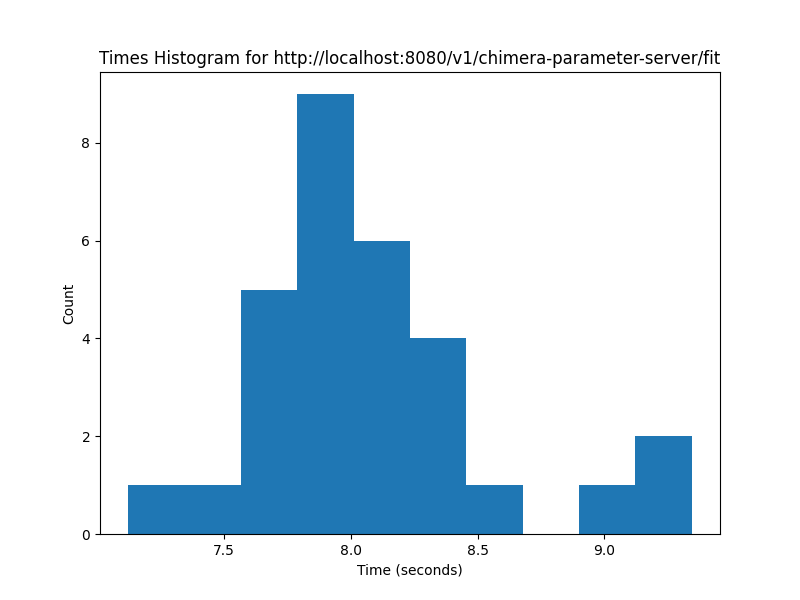

# Chimera Examples

## Chimera

### Times

- `ex_chimera_bagging_classification_rand_forest`
    - unprocessed `diabetes` dataset
    - run with 1 - 4 workers (decision tree)
    - times histograms for each endpoint

        - 1 worker
        

            
        

        

            
        

        - 2 workers
        

            
        

        

            
        

        - 3 workers
        

            
        

        

            
        

        - 4 workers
        

            
        

        

            
        

- `ex_chimera_bagging_regression_rand_forest`
    - unprocessed `heart_rate` dataset
    - run with 1 - 4 workers (decision tree)
    - times histograms for each endpoint
        - 1 worker
        

            
        

        

            
        

        - 2 workers
        

            
        

        

            

        - 3 workers
        

            
        

        

            

        - 4 workers
        

            
        

        

            

- `ex_chimera_sgd_classification_log_reg`
    - unprocessed `diabetes` dataset
    - maximum of 200 iterations
    - run with 1 - 7 workers (logistic regressor)
    - times histograms for each endpoint
        - 1 worker
        

            
        

        

            
        

        
        - 2 workers
        

            
        

        

            
        

        - 3 workers
        

            
        

        

            
        

        - 4 workers
        

            
        

        

            
        

        - 5 workers
        

            
        

        

            
        

        - 6 workers
        

            
        

        

            
        

        - 7 workers
        

            
        

        

            
        

- `ex_chimera_sgd_regression_lin_reg`
    - unprocessed `wine_quality` dataset
    - maximum of 200 iterations
    - run with 1 - 7 workers (linear regressor)
    - times histograms for each endpoint
        - 1 worker
        

            
        

        

            
        

        - 2 workers
        

            
        

        

            
        

        - 3 workers
        

            
        

        

            
        

        - 4 workers
        

            
        

        

            
        

        - 5 workers
        

            
        

        

            
        

        - 6 workers
        

            
        

        

            
        

        - 7 workers
        

            
        

        

            
        

### Classification Metrics on Validation

[TODO]

### Regression Metrics on Validation

[TODO]

## Scikit-learn

### Times

- `ex_sklearn_bagging_classification_rand_forest`
    - unprocessed `diabetes` dataset
    - run with 1 - 4 estimators (decision tree)
    - times histograms for each endpoint
        - 1 estimator
        

            
        

        
        - 2 estimators
        

            
        

        - 3 estimators
        

            
        

        - 4 estimators
        

            
        

- `ex_sklearn_bagging_regression_rand_forest`
    - unprocessed `heart_rate` dataset
    - run with 1 - 4 estimators (decision tree)
    - times histograms for each endpoint
        - 1 estimator
        

            
        

        
        - 2 estimators
        

            
        

        - 3 estimators
        

            
        

        - 4 estimators
        

            
        

- `ex_sklearn_sgd_classification_log_reg`
    - unprocessed `diabetes` dataset
    - maximum of 200 iterations
    - times histograms for each endpoint
        

            
        

- `ex_sklearn_sgd_regression_lin_reg`
    - unprocessed `wine_quality` dataset
    - maximum of 200 iterations
    - times histograms for each endpoint
        

            
        

### Classification Metrics on Validation

[TODO]

### Regression Metrics on Validation

[TODO]
